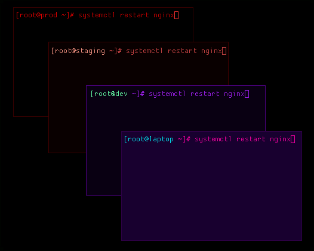

# prod-is-red

Your terminal changes color depending on which machine you are typing into.
Production is red.



```
ssh prod       ->  crimson void
ssh staging    ->  submarine
ssh dev        ->  ultraviolet
ssh laptop     ->  synthwave
exit           ->  back to normal
```

**All of it is yours to pick.** Nothing above is baked in: not the host names, not
the palettes, not the colors. One row per host in `host-tints.conf` says which
kitty theme to load and what the window border should be:

```
# <host>  <kitty-theme>  <active-border>  <inactive-border>
prod      crimson-void   rgb(cc0000)      rgb(330000)
staging   submarine      rgb(ffaa44)      rgb(400000)
```

The theme is any kitty color config you drop in `themes/`, eight ship with it,
and the two border colors are the focused and unfocused states of the window.
`bin/add-host <name> <theme>` scaffolds a new one. The only opinion the tool
holds is the one in its name.

For [kitty](https://sw.kovidgoyal.net/kitty/) + [fish](https://fishshell.com/) +
[Hyprland](https://hypr.land/). Roughly 150 lines of fish.

## Why

Everyone who has run infrastructure for a while has a story about the command
they ran on the wrong box. The tab looked the same. The prompt looked the same.
`prod` and `dev` are four characters apart and one of them costs you a weekend.

You cannot fix that with discipline, because the failure happens exactly when
your attention is elsewhere: you are three commands deep, thinking about the
problem rather than about which window you are in. That is the moment the
identical black rectangles stop being a cosmetic detail.

So make the machine tell you, in a way you cannot fail to notice and cannot
forget to check.

## How it works

Three moving parts, and the interesting decision is where the state lives.

1. **The wrapper** (`ssh.fish`) wraps `ssh`, looks the host up in
   `host-tints.conf`, and swaps the kitty palette before connecting. On exit it
   restores the default.
2. **The remote announces itself.** Its `fish_title` emits `prod:~` as the
   terminal title on every prompt. One function, pushed by `bin/deploy-remote`.
3. **Hyprland matches the title** and paints the window border to match.

**Nothing tracks state.** No per-window property, no bookkeeping, no cleanup when
a window dies or an ssh drops or a laptop suspends mid-session. The title *is*
the state, the remote owns it, and it is correct by construction: exit and the
title reverts, so the border reverts. Delete a host's row and it is entirely,
completely gone.

That is worth dwelling on, because the obvious implementation is to set a
property on the window when you connect and unset it when you leave. Then you own
that state, and you get to handle every way a session can end without telling
you: dropped connections, killed terminals, suspend, `exec`, nested ssh. Letting
the remote own it means there is no such thing as a stale tint.

## Two things that bite

**The non-TTY guard is not optional.** `rsync`, `scp`, `git` over ssh, and
`ssh host 'cmd'` all drive `ssh` while something else reads its stdout. The
wrapper calls `clear`, and `clear` writes `\033[2J\033[H` to stdout, which
becomes part of *the data stream those tools are parsing*. So the wrapper does
nothing unless stdout is a TTY and you are actually in kitty:

```fish
if test -z "$host"; or test -z "$KITTY_PID"; or not isatty stdout
    command ssh $argv
    return
end
```

Without that check the tool silently corrupts your file transfers, which is a
memorable way to learn about it.

**OpenSSH does not forward `COLORTERM`.** Without it fish decides the terminal is
16-color and quantizes every `set_color <hex>` down to the nearest palette slot,
so your carefully chosen host color silently becomes "whatever color2 is". Three
things keep it honest:

1. `SendEnv COLORTERM` in your local `~/.ssh/config` `Host *` block
2. `AcceptEnv COLORTERM` on the remote sshd
3. `set -U fish_term24bit 1` on the remote, which `deploy-remote` does for you as
   a backstop when 1 and 2 are not available (a box you do not own sshd on)

## Install

```fish
git clone https://github.com/pxlwh/prod-is-red
cd prod-is-red
./install.fish                  # links ssh.fish + themes, copies the host registry
```

Then:

1. Edit `~/.config/hypr/host-tints.conf` (copied from
   [host-tints.conf.example](host-tints.conf.example)) and list your hosts.
2. Paste [hyprland/windowrules.lua.example](hyprland/windowrules.lua.example)
   into your `~/.config/hypr/windowrules.lua`.
3. `bin/deploy-remote <host>` for each fish remote.
4. `hyprctl reload`

Adding one later:

```fish
bin/add-host prod crimson-void
bin/deploy-remote prod
```

Your hosts live in `~/.config/hypr/host-tints.conf`, never in this checkout. That
is deliberate: a tool that keeps your fleet inside its own git repo is a tool
that leaks your fleet the day you push it somewhere.

## bash remotes

`fish_title` obviously never runs under bash, so set the title from `PS1`
instead. Note it must be **in PS1**, not `PROMPT_COMMAND`: many distro defaults
(NixOS among them) bake their own title escape into PS1, and PS1 is drawn *after*
`PROMPT_COMMAND` runs. Set the title from `PROMPT_COMMAND` and it is overwritten
every prompt, so the border flashes the right color and then snaps back.

```bash
# ~/.bashrc on the remote — 'prod' is what you type at `ssh`
PS1='\[\e]0;prod:\w\a\]'"$PS1"
```

## Debugging

```sh
hyprctl clients -j | grep title
```

If the title is not `<host>:...`, the problem is on the remote, not in Hyprland.

## Themes

`default` (restored on exit), `crimson-void`, `submarine`, `ultraviolet`,
`synthwave`, `aperture`, `bbs-night`, `proxmox`. Any kitty color config works;
drop it in `themes/` and name it in `host-tints.conf`.

## License

MIT, see [LICENSE](LICENSE).
